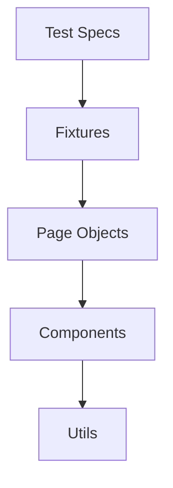

# 🎓 SANTS Frontend Automation Tests

<div align="center">

[](https://playwright.dev)
[](https://www.typescriptlang.org/)
[](https://nodejs.org/)

</div>

This repository contains automated test suites for the SANTS Frontend application using Playwright. The tests cover various areas including student management, applications, marketing, WIL, and administrative functions.

## 🎯 Test Coverage

The automation suite includes tests for:

📚 **Core Features**

- Student Portal functionality
- Academic Progress tracking
- Application processes

🔧 **Business Functions**

- WIL (Work Integrated Learning) features
- Marketing and Assessor management
- Administrative functions

## 🚀 Getting Started

### Prerequisites

Before running the tests, ensure you have the following installed:

⚡ **Required Software**

- [Node.js](https://nodejs.org/) (Latest LTS version recommended)
- [npm](https://www.npmjs.com/) (Comes with Node.js)
- [VScode](https://code.visualstudio.com/) (IDE to access the tests and make changes to them)

### 🔧 Installation

1. Clone the repository:

```bash
git clone [repository-url]
```

2. Navigate to the project directory:

```bash
cd MySANTS_Automation
```

3. Install dependencies:

```bash
npm install
```

4. Install Playwright browsers:

```bash
npx playwright install
```

## ▶️ Running Tests

Here are the main commands you'll need:

### 🧪 Test Execution

```bash
# Run all tests
npx playwright test

# Run tests with browser visible
npx playwright test --headed

# Run specific test file
npx playwright test [test-file-name]
```

### 📊 Test Reports

After running the tests, you can view the Allure report by running:

```bash
npx allure serve allure-results
```

## 📁 Project Structure

```
📦 MySANTS_Automation
├── 📂 automation/
│   ├── 📂 Test_Documents/    # Test files and fixtures
│   ├── 📂 tests/
│   │   ├── 📂 fixtures/      # Test configurations
│   │   ├── 📂 pages/         # Page object models
│   │   │   ├── 📂 components/  # Reusable UI components
│   │   │   ├── 📂 portal/     # Portal page objects
│   │   │   └── 📂 dialogs/    # Dialog components
│   │   └── 📂 specs/         # Test specifications
│   └── 📂 utils/            # Utility functions
├── 📊 allure-results/       # Test reports
├── 📝 test-results/        # Test artifacts
└── ⚙️ playwright.config.ts  # Configuration
```

## 🌐 Environment Configuration

The framework supports multiple environments:

| Environment | Description             |
| ----------- | ----------------------- |
| 🔧 DEV      | Development             |
| 🧪 UAT      | User Acceptance Testing |
| 🚦 STG      | Staging                 |
| 🌟 PROD     | Production              |

> Environment-specific configuration is managed in `playwright.config.ts`

## 🏗️ Framework Architecture

The framework follows a layered architecture for maintainability and reusability:

### 📝 Test Layer (`automation/tests/specs/`)



- Contains actual test implementations
- Uses fixtures for authentication and setup
- Focuses on business scenarios and assertions

### 🔧 Fixtures Layer (`automation/tests/fixtures/`)

- Extends Playwright's base test functionality
- Provides:
  - 🌍 Environment detection
  - 🌐 Browser context setup
  - 🔐 Authentication handling
  - 📊 Test data management

### 📱 Page Objects Layer (`automation/tests/pages/`)

- Implements Page Object Model pattern
- Contains:
  - 🔨 **BasePage**: Common functionality
  - 🔑 **LoginPage**: Authentication handling
  - 📄 Other page-specific classes

### 🧩 Components Layer

- 🔄 Reusable UI components
- 🍪 Common elements (cookie banners, etc.)
- ♻️ Promotes code reuse

### 🛠️ Utils Layer (`automation/utils/`)

- Helper functions
- Global configurations
- Common utilities

### ⭐ Key Features

- **Type Safety**: Built with TypeScript
- **Environment Awareness**: Automatic environment detection
- **Clean Architecture**: Separation of concerns
- **Reusable Components**: Modular design
- **Automatic Cleanup**: Managed by fixtures

## Key Features

- TypeScript-based test implementation
- Page Object Model pattern
- Modular test components
- Multi-environment support
- Allure reporting integration
- Automatic cookie handling
- Reusable UI component library
- Robust authentication handling

## 👩‍💻 Development Workflow

1. ✍️ Write tests in `/automation/tests/specs/` organized by feature
2. 🏗️ Create page objects in `/automation/tests/pages/`
3. 🧩 Add reusable components in `/automation/tests/pages/components/`
4. 🔐 Use auth fixtures from `/automation/tests/fixtures/`
5. 🛠️ Add utility functions in `/automation/utils/` as needed

## 📘 Additional Information

- 📝 Tests written using TypeScript and Playwright
- 📊 Results in `allure-results` directory
- 📸 Automatic screenshots and videos for failed tests

## 🤝 Contributing

1. 🌿 Create a new branch
2. 💻 Make your changes
3. 📤 Create a pull request

## 💬 Support

Need help? Create an issue in the repository!

## 📚 Resources

<div align="center">

[](https://playwright.dev/)

</div>
